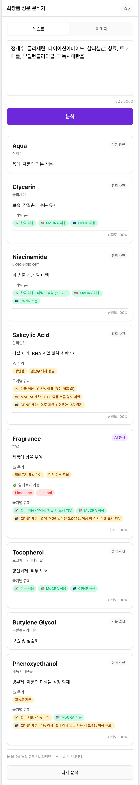

# 화장품 성분 분석기

화장품 성분표(텍스트 또는 이미지)를 입력하면 AI가 각 성분의 **효능 · 주의사항 · 알레르기 가능성 · 국가별 규제** 정보를 분석해 카드 형태로 보여주는 모바일 웹 도구입니다.

## 데모

🔗 **라이브**: https://cosmetic-ingredient-analyzer.vercel.app

성분표를 붙여넣거나 라벨 사진을 올리면, AI가 각 성분을 **safe / notable** 두 등급으로 나눠 분석합니다. 규제·주의가 없는 기본 성분은 간단히, 규제·알러젠 가능성이 있는 성분만 국가별 규제·주의사항까지 상세히 보여줍니다.

<p align="center">
  
</p>

## 지원 규제 지역

| 약어 | 의미 |
|---|---|
| **KR** | 한국 (식약처 화장품법 / 화장품 안전기준 등에 관한 규정) |
| **MoCRA** | 미국 — Modernization of Cosmetics Regulation Act of 2022 (FDA) |
| **CPNP** | EU — Cosmetic Products Notification Portal (Regulation (EC) No 1223/2009) |

## 핵심 설계 결정

### 1. Spec-Driven Development
모든 기능은 [`SPEC.md`](./SPEC.md)에 명세된 뒤 구현합니다. 커밋 메시지 본문의 `Refs: SPEC.md §N` 으로 명세-구현 추적이 가능합니다. Day 0에 SPEC 작성 + 사전 논리 점검 15개 항목 통과 후 코드 작업을 시작했습니다.

### 2. 멀티 모델 폴백 (OpenAI + Claude)
하나의 AI 프로바이더가 장애를 일으켜도 다른 프로바이더로 자동 전환됩니다. 8가지 에러 분류(network / rate_limit / timeout / invalid_output / content_filter / auth / bad_request / unknown) 중 `auth`·`bad_request`는 즉시 throw해 사용자 quota를 보호합니다.

→ 구현: [`api/_lib/fallback.ts`](./api/_lib/fallback.ts), [`api/_lib/errors.ts`](./api/_lib/errors.ts)

### 3. 대량 성분 분석 성능 — tier 선별 단일 호출
실제 화장품 라벨(~50성분)을 모두 풀 분석(성분당 효능·주의·알러젠·규제3지역)하면 출력 토큰이 성분 수에 비례해 폭증, gpt-4o로도 60~70s가 걸려 Vercel `maxDuration: 60s`를 초과했습니다. **호출을 나누는 대신 출력을 줄이는** 방향으로, AI가 각 성분을 `safe`/`notable`로 분류해 안전 성분은 간단히·주의 성분만 상세히 출력하게 했습니다. 출력이 절반↓로 줄어 **50성분 텍스트 22s / 이미지 39s**로 단축(단일 호출 유지).

→ 구현: [`api/_lib/prompt.ts`](./api/_lib/prompt.ts), [`SPEC.md §12`](./SPEC.md)

### 4. 하이브리드 도메인 데이터 (안전망)
LLM은 자연어 설명에 강하지만 국가별 규제 정보는 환각 위험이 큽니다. 고위험·국가별 차이 큰 성분 **50개**는 정적 사전으로 큐레이션해 AI 응답을 덮어쓰고(`source: 'static'`), AI가 안전으로 잘못 분류해도 사전에 있으면 `notable`로 강제 승격합니다. 카드에 출처(`정적 사전` / `AI 분석` / `기본 안전`)를 명시해 투명하게 노출합니다.

→ 구현: [`api/_lib/regulations.ts`](./api/_lib/regulations.ts), [`api/_lib/postProcess.ts`](./api/_lib/postProcess.ts)

### 5. 백엔드 부재 + API 키 보호
프론트에서 OpenAI/Claude API를 직접 호출하면 키가 클라이언트 번들에 노출됩니다. Vercel Functions를 프록시 계층으로 두어 키를 서버 환경변수로만 접근합니다.

→ 구현: [`api/analyze.ts`](./api/analyze.ts), [`SECURITY.md`](./SECURITY.md)

### 6. AI 비용 보호 (IP당 일일 5회)
본인 OpenAI/Claude 키 비용 폭발 방지를 위해 Vercel KV(Upstash Redis) 기반 rate limit을 적용합니다. 메모리 기반은 stateless 환경에서 무력하므로 외부 저장소 필수. 키에 KST 날짜를 박아(`rate:<ip>:<YYYY-MM-DD>`) 자정마다 자동 리셋되고, TTL로 옛 키는 자동 정리됩니다. 폴백으로 provider가 여러 번 호출돼도 사용자 quota는 1회만 소모됩니다.

→ 구현: [`api/_lib/rateLimit.ts`](./api/_lib/rateLimit.ts)

### 7. AI 협업 하네스
AI 도구가 매번 코드베이스를 처음부터 탐색하지 않도록 진입점 ↔ 명세 ↔ 규칙 ↔ 학습 기록을 별도 문서군으로 정리했습니다.

| 문서 | 용도 |
|---|---|
| [`CLAUDE.md`](./CLAUDE.md) | 진입 라우팅 |
| [`AGENTS.md`](./AGENTS.md) | 첫 진입 지식맵 |
| [`SPEC.md`](./SPEC.md) | 제품/API/데이터/엣지 명세 |
| [`CODE_CONVENTION.md`](./CODE_CONVENTION.md) | 폴더 / 네이밍 / 컴포넌트 패턴 |
| [`SECURITY.md`](./SECURITY.md) | 금지 패턴 / 키 관리 |
| [`WORKFLOW.md`](./WORKFLOW.md) | 브랜치 / 커밋 / 배포 |
| [`LESSONS.md`](./LESSONS.md) | 누적 학습 기록 |
| [`.claude/commands/pr.md`](./.claude/commands/pr.md) | `/pr` 슬래시 커맨드 |

## 기술 스택

**프론트엔드**: React 19 / TypeScript / Vite / emotion / Zustand
**서버리스**: Vercel Functions (Node runtime)
**AI**: OpenAI (`gpt-4o`, Vision) · Anthropic Claude (`claude-3-5-haiku`) 폴백
**저장소**: Vercel KV (Upstash Redis)
**테스트**: Vitest

## 폴더 구조

```
.
├── SPEC.md                       # 명세 (변경 전 먼저 갱신)
├── api/                          # Vercel Functions
│   ├── analyze.ts                # POST /api/analyze 진입점
│   └── _lib/
│       ├── providers/            # OpenAI / Claude 어댑터
│       ├── fallback.ts           # 멀티 폴백 오케스트레이션
│       ├── prompt.ts             # 시스템 프롬프트 + few-shot
│       ├── schema.ts             # zod 스키마 (FromAI / 후처리 후 2단)
│       ├── postProcess.ts        # AI 응답 + 정적 사전 정합 (안전망)
│       ├── regulations.ts        # 정적 사전 50개 + 매칭
│       ├── rateLimit.ts          # Vercel KV 기반 일일 5회
│       └── errors.ts             # ProviderError 분류
├── src/                          # React 클라이언트
│   ├── views/analyzer/           # 단일 도메인 (View/Hook/Style 분리)
│   ├── store/                    # Zustand
│   ├── lib/api.ts                # /api/analyze 클라이언트 (단일 진입점)
│   ├── components/               # base / common
│   └── styles/                   # theme / globals / emotion 타입
└── tests/                        # Vitest (한글 describe/it)
```

## 로컬 실행

### 사전 준비
- Node.js 20+
- [Vercel CLI](https://vercel.com/cli): `npm i -g vercel`
- OpenAI API 키 + Anthropic API 키 (선택적 — 한쪽만 있어도 동작)
- Vercel KV (선택적 — 없으면 rate limit fail-open)

### 설치
```bash
git clone https://github.com/geunee92/cosmetic-ingredient-analyzer.git
cd cosmetic-ingredient-analyzer
npm install
```

### 환경변수
`.env.sample`을 `.env.local`로 복사한 뒤 키를 채웁니다:
```bash
cp .env.sample .env.local
# .env.local 편집 — OPENAI_API_KEY, ANTHROPIC_API_KEY, KV_REST_API_*
```

### 개발 서버
```bash
# UI만 (Functions는 mock 응답 필요)
npm run dev

# Vercel Functions + UI 통합 (권장)
npm run api:dev
```

### 테스트
```bash
npm run test:run    # 단발
npm test            # watch
```

## 배포

`main` 브랜치 push → Vercel 자동 빌드/배포.
환경변수는 Vercel 대시보드 → Settings → Environment Variables에서 설정.

## 참조 자료 (정적 사전 출처)

- 한국: 식품의약품안전처 — 「화장품법 시행규칙 별표 4」, 「화장품 안전기준 등에 관한 규정」
- 미국: FDA Modernization of Cosmetics Regulation Act of 2022 (MoCRA)
- EU: Regulation (EC) No 1223/2009 — Annex II/III, CosIng database
- 알러젠: SCCS Opinion on Fragrance Allergens (EU 26)

v1 사전은 일반 자료 기반 초안이며, 정식 서비스 출시 전 식약처/CosIng 교차 검증이 필요합니다.

## 라이선스

MIT
